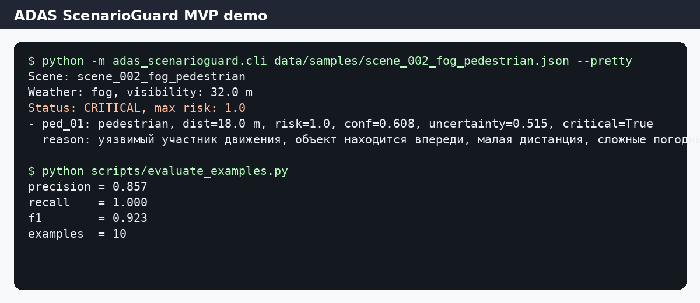

# ADAS ScenarioGuard

Учебный open-source MVP для моей ВКР по теме обнаружения редких и критических сценариев в мультимодальном восприятии ADAS.

Прототип получает описание дорожной сцены в JSON, объединяет оценки камеры, LiDAR и radar, считает неопределенность и выдает флаг критического сценария. Это не сертифицированная ADAS-система и не модуль управления автомобилем. Сейчас это минимальный рабочий прототип для проверки логики анализа риска.

## Что умеет MVP

- принимает JSON-сцену с объектами и показаниями трех сенсоров;
- считает надежность сенсоров с учетом погоды, видимости и окклюзии;
- объединяет confidence камеры, LiDAR и radar;
- оценивает uncertainty и risk score;
- помечает сцену как `CRITICAL` или `OK`;
- считает precision, recall, F1 и FPS на 10 контрольных примерах.

## Демонстрация



Пример запуска:

```bash
python -m adas_scenarioguard.cli data/samples/scene_002_fog_pedestrian.json --pretty
```

Пример результата:

```text
Scene: scene_002_fog_pedestrian
Weather: fog, visibility: 32.0 m
Status: CRITICAL, max risk: 1.0
- ped_01: pedestrian, dist=18.0 m, risk=1.0, conf=0.608, uncertainty=0.515, critical=True
```

## Установка

```bash
git clone https://github.com/<username>/adas-scenarioguard.git
cd adas-scenarioguard
python -m venv .venv
source .venv/bin/activate      # Linux/macOS
# .venv\\Scripts\\activate     # Windows
pip install -r requirements.txt
pip install -e .
```

## Запуск

Анализ одной сцены:

```bash
python -m adas_scenarioguard.cli data/samples/scene_002_fog_pedestrian.json --pretty
```

Сохранение результата в JSON:

```bash
python -m adas_scenarioguard.cli data/samples/scene_002_fog_pedestrian.json \
  --output results/example_output.json
```

Оценка на контрольных примерах:

```bash
python scripts/evaluate_examples.py
```

После запуска создаются файлы:

- `results/metrics.json`
- `results/metrics.csv`
- `results/predictions.json`

## Контрольные метрики MVP

Метрики ниже получены на 10 небольших JSON-сценах из папки `data/samples`. Это проверка работы прототипа, а не полноценный бенчмарк на nuScenes или DENSE.

| Метрика | Значение |
|---|---:|
| Precision | 0.857 |
| Recall | 1.000 |
| F1 | 0.923 |
| TP / FP / FN / TN | 6 / 1 / 0 / 3 |
| FPS JSON-pipeline | зависит от компьютера, обычно больше 1000 FPS |

## Формат входных данных

Пример входного JSON:

```json
{
  "id": "scene_002_fog_pedestrian",
  "weather": "fog",
  "visibility_m": 32,
  "ego_speed_kmh": 38,
  "objects": [
    {
      "id": "ped_01",
      "class": "pedestrian",
      "distance_m": 18,
      "relative_lane": "front",
      "occlusion": 0.25,
      "camera_conf": 0.42,
      "lidar_conf": 0.72,
      "radar_conf": 0.58
    }
  ]
}
```

Схема описана в `data/schema/example_scene_schema.json`.

## Используемые пакеты

Основной код работает на стандартной библиотеке Python. Дополнительно используются:

- `Pillow` для генерации demo-скриншота;
- `pytest` для простых unit-тестов.

Список зависимостей указан в `requirements.txt`.

## Тесты

```bash
pytest
```

## Структура репозитория

```text
adas-scenarioguard/
├── src/adas_scenarioguard/      # код MVP
├── data/samples/                # 10 контрольных сцен
├── data/schema/                 # схема входного JSON
├── scripts/                     # оценка и генерация demo
├── results/                     # метрики и предсказания
├── demo/                        # скриншот и вывод CLI
├── docs/                        # краткое описание отчета и презентации
├── tests/                       # unit-тесты
├── README.md
├── CHANGELOG.md
├── requirements.txt
└── LICENSE
```

## Ссылки на отчет и презентацию

- Краткое описание отчета: `docs/report_summary.md`
- Заметки к презентации: `docs/presentation_notes.md`

## Лицензия

MIT License. См. файл `LICENSE`.
